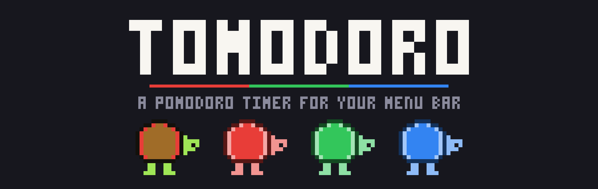
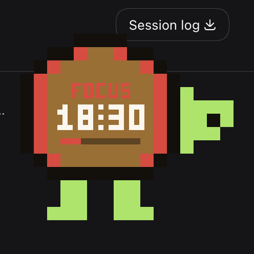
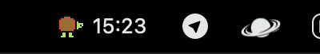
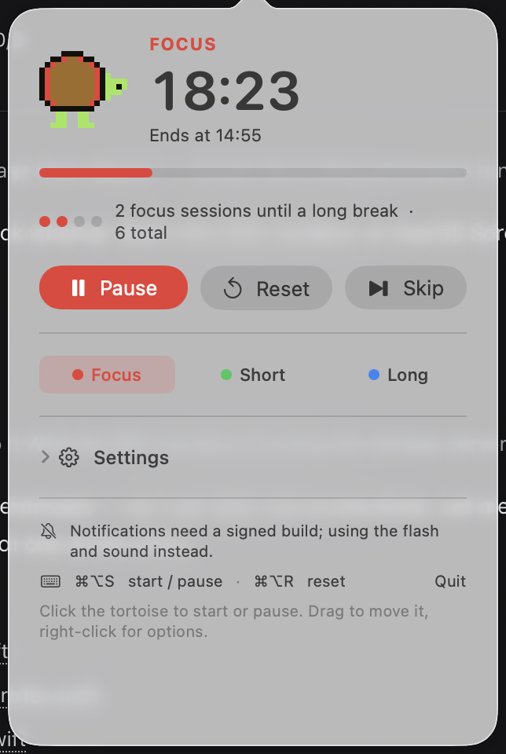
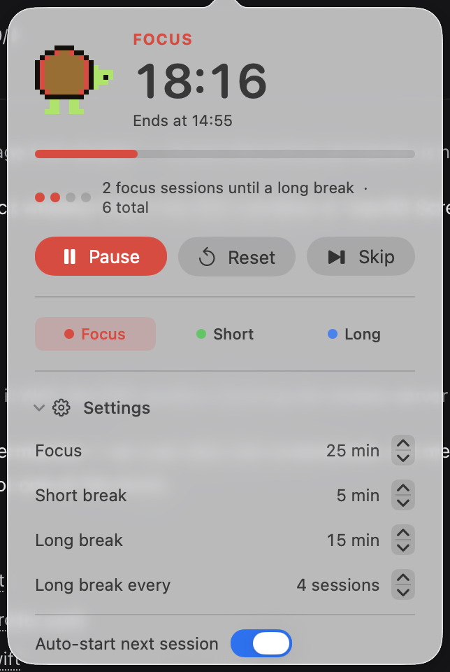
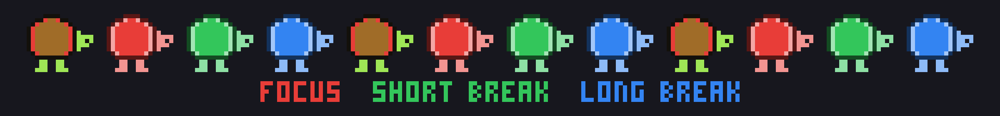

# Tomodoro

A macOS menu bar Pomodoro timer whose mascot is a 16x16 pixel-art tortoise. The
tortoise floats on your desktop as an overlay, with the countdown rendered inside
its shell in the same pixel grid as the art.

Session state is shown by colour: **red** for focus, **green** for a short break,
**blue** for a long break.



## Features

- **Menu bar only** (LSUIElement): no Dock icon, no ordinary windows.
- **Tortoise overlay**: a borderless, always-on-top panel shaped like the art
  itself. The countdown, phase label and progress bar are drawn inside the shell
  using a 3x5 pixel font, so everything shares one visual language. Click it to
  start or pause, drag to move it, right-click for options. Transparent pixels
  fall through, so it never steals a click meant for the app behind it, and
  either menu can switch it off entirely.
- **Standard cadence**: 25 min focus, 5 min short break, 15 min long break after
  every 4 focus sessions. All durations adjustable.
- **Global hotkeys**: `⌥⌘S` start/pause, `⌥⌘R` reset. Registered through
  Carbon, so they need no Accessibility permission.
- **Sleep-proof timer**: the countdown is derived from an absolute end date, never
  from an incrementing counter. See below.
- **Session-end alerts**: native notifications when the build is signed, plus a
  menu bar flash and an audible alert that always fire.

## Installing it

You do not need to know anything technical to use this. Tomodoro is a menu bar
app: once it is running there is no window and no Dock icon, just a small
tortoise at the top right of your screen next to the clock.



### Installing on this Mac

1. Double-click **Install Tomodoro.command** in this folder. A Terminal window
   opens and does the work.
2. If macOS asks whether you are sure you want to open it, click **Open**.
3. The tortoise appears in your menu bar. You can close the Terminal window.

The installer puts Tomodoro in your own Applications folder. It needs no
administrator password and changes nothing else on your Mac.

### Making it start automatically

1. Open **System Settings**, then **General**, then **Login Items**
2. Under "Open at Login", click **+**
3. Choose **Tomodoro** from your Applications folder

### Uninstalling

Quit Tomodoro from its menu (right-click the tortoise, then **Quit Tomodoro**),
then drag **Tomodoro** out of your Applications folder.

### Passing it on to someone else

Send them **Tomodoro.app** (or the app together with the installer). The first
time they open it, macOS will warn that it cannot check the app for malicious
software. That is expected: the app is not signed with a paid Apple developer
certificate. Tell them to:

1. **Right-click** (or Control-click) **Tomodoro**
2. Choose **Open**
3. Click **Open** in the dialog that appears

macOS remembers the choice, so after that it opens normally.

## Building

The project is generated from `project.yml` with
[XcodeGen](https://github.com/yonaskolb/XcodeGen), then built with Xcode:

```sh
brew install xcodegen      # once
xcodegen generate          # regenerate Tomodoro.xcodeproj after editing project.yml
open Tomodoro.xcodeproj    # then build and run in Xcode
```

From the command line:

```sh
xcodegen generate
xcodebuild -project Tomodoro.xcodeproj -scheme Tomodoro -configuration Debug \
  -derivedDataPath .build/DerivedData build
```

`Tomodoro.xcodeproj` is generated and gitignored; `project.yml` is the source of
truth, which keeps the project file out of merge conflicts.

## Tests

```sh
xcodebuild -project Tomodoro.xcodeproj -scheme Tomodoro \
  -derivedDataPath .build/DerivedData test
```

71 tests cover the sprite, the rendering pipeline, the banner layout, the overlay
geometry and the timer engine. Highlights:

- **Engine**: countdown accuracy from the wall clock, sleep/wake reconciliation,
  drift-free multi-session catch-up, the long-break cadence, auto-start, controls,
  settings changes, and persistence across a relaunch.
- **Sprite**: the art is structurally validated. A flood fill proves every pixel
  is connected, so a limb cannot silently float free of the shell, and the
  region reserved for the countdown must be plain shell.
- **Rendering**: the sprite is encoded to a PNG, decoded back, and compared
  pixel by pixel. This is what catches a flipped or mirrored image, which a test
  that only inspects the source grid cannot see.
- **Geometry**: the overlay never exceeds its screen, and the popover's height is
  bounded by the space actually available.

## Notifications need a real signature

Native notifications go through `UNUserNotificationCenter`, and macOS refuses
notification authorization to apps that are only **ad-hoc signed**. Out of the
box the project is ad-hoc signed so it builds with no Apple ID configured, and
the app logs:

```
Notifications are not allowed for this application
```

It then falls back to the menu bar flash and an audible alert, so a session
ending is never silent.

To enable real banners, give the app a real signature:

1. **Xcode > Settings > Accounts** and add your Apple ID. A free account is enough.
2. Open `Configs/Signing.xcconfig`, comment out the two ad-hoc lines, and
   uncomment the automatic-signing pair, filling in your `DEVELOPMENT_TEAM`.
3. Rebuild. The first launch asks for notification permission.

Signing lives in an xcconfig rather than the project file so the choice survives
regenerating the project.

Diagnostics, if you want to check the current state:

```sh
Tomodoro.app/Contents/MacOS/Tomodoro --diagnose
Tomodoro.app/Contents/MacOS/Tomodoro --test-notification
```

`--diagnose` prints the bundle, hotkey and notification status.
`--test-notification` requests permission and posts a real banner. There is also
a capped log at `~/Library/Logs/Tomodoro/diagnostics.log`, and
`--diag-file PATH` writes it somewhere else.

## Usage

Left-click the tortoise in the menu bar to open the dropdown:



Settings expand in place, and scroll if your screen is short:



| Action | How |
| --- | --- |
| Start / pause | `⌥⌘S`, the overlay, or the menu bar button |
| Reset current session | `⌥⌘R` |
| Skip to next phase | Menu bar dropdown, or the overlay's right-click menu |
| Move the overlay | Drag it |
| Show / hide the overlay | **Show Overlay** in the right-click menu, or the dropdown settings |
| Keep the overlay up while idle | "Keep overlay visible when idle" in settings |
| Open the menu | Left-click the tortoise in the menu bar |
| Quick commands | Right-click either tortoise |

The overlay appears while a session is in progress and hides when the timer is
idle at full duration. Pausing does not hide it, so you can resume without
hunting for it.

### Overlay visibility

The Show Overlay switch in either menu flips between shown and hidden. Behind it
there are three states:

| State | Behaviour |
| --- | --- |
| Automatic | Visible while a session is in progress; hides when the timer is idle at full duration. The default. |
| Always visible | Never hides on its own. Reached by turning on "Keep overlay visible when idle". |
| Hidden | Never shown, even during a session. |

Switching the overlay back on while a session is running returns it to
Automatic. Switching it back on while the timer is idle pins it instead, so the
switch always has a visible effect rather than appearing to do nothing until the
next session. The choice is remembered across launches.

## Why the timer is date-based

While running, the single source of truth is `endDate`, an absolute wall-clock
instant. Remaining time is recomputed as `endDate - now()` on every tick, so
nothing depends on a counter that would stop advancing while the machine sleeps.

On wake the app re-derives the remaining time, walks forward any phases that
elapsed during sleep starting from the scheduled end instant rather than from
"now" so no drift accumulates, and re-arms the ticker. A long sleep produces a
single coalesced alert instead of a stack of stale banners. The same logic lets
the timer survive quitting and relaunching.

## Project layout

```
project.yml                 XcodeGen spec: targets, schemes, build settings
Configs/Signing.xcconfig    ad-hoc by default; switch here for real signing
Resources/Info.plist        LSUIElement, bundle id, icon
Sources/
  Core/                     no UI, fully testable
    TortoiseSprite.swift    the 16x16 bitmap, palettes, structural validation
    PixelFont.swift         3x5 pixel font for digits and letters
    OverlayGeometry.swift   overlay and popover geometry, hit testing
    OverlayVisibility.swift show/hide states and the Show Overlay switch
    PomodoroEngine.swift    date-based state machine and persistence
  App/
    main.swift              entry point and CLI modes
    AppDelegate.swift       wiring: menu bar, overlay, hotkeys, wake handling
    OverlayWindow.swift     the tortoise panel, dragging and click-through
    StatusItemController.swift  menu bar item and dropdown
    HotKeyManager.swift     Carbon global hotkeys
    NotificationManager.swift   UNUserNotificationCenter wrapper
    TortoiseImage.swift     sprite -> NSImage, integer-scaled
    AppIconRenderer.swift   app icon, rendered from the sprite at build time
    Diagnostics.swift       headless self-checks and the diagnostic log
  UI/
    TortoiseOverlayView.swift  the overlay, drawn in one Canvas
    PopoverView.swift          the menu bar dropdown
    Theme.swift                colours, formatting, shared views
Tests/TomodoroTests/        XCTest suite
Screenshots/                images used by this README
Install Tomodoro.command    double-click installer for non-technical users
Tools/                      optional art debugging helpers (Python, stdlib only)
```

The app icon is generated from the sprite during the build by running the freshly
built binary in an `--export-iconset` mode, so the icon can never drift from the
art. Note that script phases run before Xcode signs the bundle, and an unsigned
Mach-O cannot execute on Apple Silicon, so the script ad-hoc signs the binary
first; Xcode re-signs the whole bundle afterwards.

## Art

The tortoise is 16x16, authored as 16 rows of text in
`Sources/Core/TortoiseSprite.swift`. The shape follows the reference art in
`Reference/`: a brown shell, bright green head and feet, and a heavy dark
keyline, side view facing right.

Because the reference palette is natural rather than phase-coloured, the phase
rides on the **shell trim band** (the ring of pixels just inside the keyline) and
on the countdown's phase label and progress fill. Setting **Tortoise: Phase tint**
in the app's settings instead colours the whole body by phase, which was the
original behaviour.

### The README banners

The header and footer at the top and bottom of this page are drawn by the app
itself, from the same sprite, palettes and pixel font, so they cannot drift from
the artwork. Regenerate them after changing the art:

`@sh
Tomodoro.app/Contents/MacOS/Tomodoro --export-banners Screenshots
`@

The header uses the wordmark and a parade of four tortoises: the natural mascot
plus one in each session colour. The footer is a frieze cycling the same four,
with each phase named in its own colour. Sizes are chosen so the small text stays
legible after GitHub scales the image down to fit the page.

`Tools/pngview.py`, `Tools/imgascii.py` and `Tools/imgcrop.py` decode, render
and crop PNGs from the command line, which is handy for inspecting art or
screenshots without opening an image viewer.

## Notes

- Minimum macOS version is 14.0.
- The overlay uses `.nonactivatingPanel`, so clicking it never steals focus
  from your work.
- The timer keeps running while the dropdown is open, because the ticker is
  scheduled in the `.common` run loop mode.


